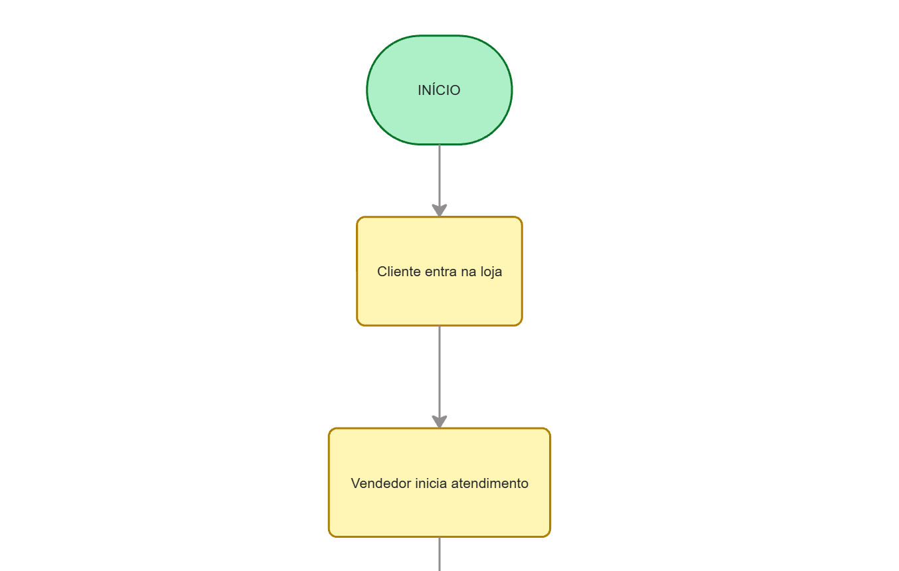

# Desafio Final – Módulo IA e Power Apps  
## Aplicação de Inteligência de Atendimento Comercial  

---

## 👤 Informações do Participante

**Nome:** Luan Prado  
**E-mail:** lzt.02102@gmail.com  
**Turma:** Noite. 

---

## 📌 Caso Escolhido

**Setor:** Comércio Local  
**Caso 4 – Atendimento em loja de eletrônicos**

### 📝 Resumo do Caso

O caso descreve um pequeno comércio de eletrônicos que realiza diversos atendimentos diariamente, mas não possui um registro estruturado do processo de atendimento.  
Embora as vendas ocorram, não existe visibilidade clara sobre:

- Dúvidas recorrentes dos clientes  
- Produtos que geram mais indecisão  
- Quantidade de atendimentos que se convertem em venda  
- Motivos de não conversão  
- Situações que geram retrabalho  

As informações existem de forma fragmentada e informal, dificultando análise, aprendizado e melhoria do processo.

---

# 🔎 1. Análise e Entendimento do Problema

## 1.1 Contexto do Cenário  
O comércio atende diferentes perfis de clientes ao longo do dia: alguns sabem exatamente o que querem, outros chegam com dúvidas ou apenas para pesquisar. O atendimento acontece de forma rápida e dinâmica, exigindo que o vendedor alterne entre diferentes situações em poucos minutos.

Apesar do fluxo constante de vendas, não existe um registro estruturado dos atendimentos realizados. As informações ficam apenas na memória dos vendedores. Isso impede que a equipe entenda padrões, melhore a abordagem e identifique onde ocorrem dificuldades no processo de venda.

O comércio funciona, mas opera com base em percepção e experiência individual, não em dados organizados.

## 1.2 Problemas Identificados  
O principal problema é a ausência de registro estruturado do atendimento.

Não é possível saber quais dúvidas são mais frequentes.

Não há controle sobre quais atendimentos viram venda.

Não se entende quais produtos geram mais indecisão.

Não há histórico para evitar retrabalho.

Cada vendedor pode orientar de forma diferente.

## 1.3 Recorte do Problema Priorizado  
A falta de registro estruturado do atendimento e da jornada do cliente.

Principal foco pois se o atendimento for registrado e organizado será possível:

Identificar padrões

Medir conversão

Detectar dúvidas recorrentes

Reduzir retrabalho

Melhorar a abordagem

## 1.4 Objetivo da Solução  
Criar um sistema simples dentro do Power Apps que permita registrar cada atendimento realizado na loja, classificando o tipo de cliente, produto envolvido, nível de indecisão, dúvidas apresentadas e resultado final.

O sistema tem que ser capaz de:

Medir taxa de conversão

Identificar produtos que geram mais dúvidas

Mapear motivos de não venda

Reduzir retrabalho

Tornar o atendimento mais previsível

---

# 🧠 2. Engenharia da Solução

## 2.1 Proposta de Valor  
A solução transforma um atendimento baseado em percepção em atendimento baseado em dados, gerando mais clareza, menos inconsistências, melhoria gradual baseada em dados reais e mais previsibilidade no dia a dia da equipe.

## 2.2 Público Usuário  
Vendedores e gerencia da loja.

## 2.3 Fluxo do Processo  
CLIQUE NA IMAGEM PARA VER O FLUXOGRAMA COMPLETO!!

