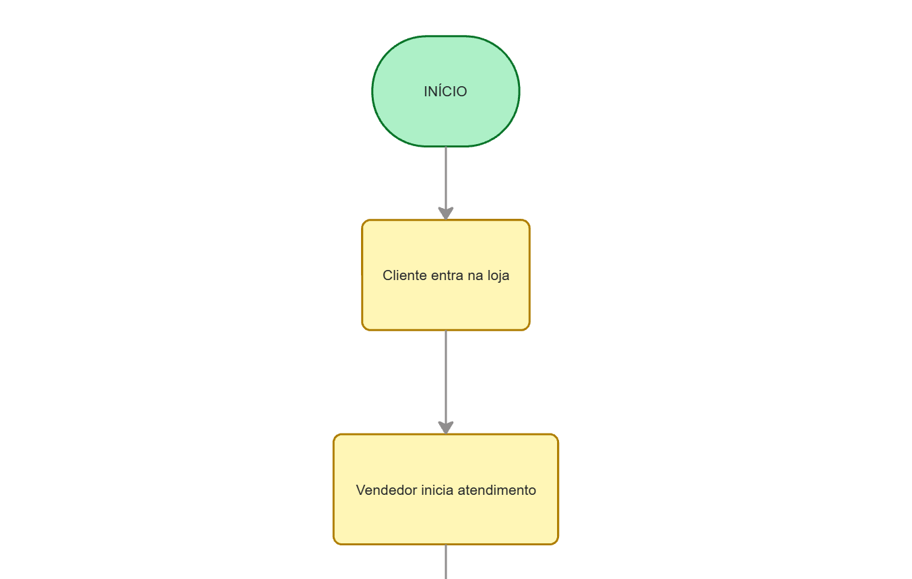

# Desafio Final – Módulo IA e Power Apps  
## Aplicação de Inteligência de Atendimento Comercial  

---

## 👤 Informações do Participante

**Nome:** Luan Prado  
**E-mail:** lzt.02102@gmail.com  
**Turma:** Noite  

---

## 📌 Caso Escolhido

**Setor:** Comércio Local  
**Caso 4 – Atendimento em loja de eletrônicos**

---

## 📝 Resumo do Caso

O caso descreve um pequeno comércio de eletrônicos que realiza diversos atendimentos diariamente, mas não possui um registro estruturado do processo de atendimento.  

Embora as vendas ocorram, não existe visibilidade clara sobre:

- Dúvidas recorrentes dos clientes  
- Produtos que geram mais indecisão  
- Quantidade de atendimentos que se convertem em venda  
- Motivos de não conversão  
- Situações que geram retrabalho  

As informações existem de forma fragmentada e informal, dificultando análise, aprendizado e melhoria do processo.

---

# 🔎 1. Análise e Entendimento do Problema

## 1.1 Contexto do Cenário  

O comércio atende diferentes perfis de clientes ao longo do dia: alguns sabem exatamente o que querem, outros chegam com dúvidas ou apenas para pesquisar.  

O atendimento acontece de forma rápida e dinâmica, exigindo que o vendedor alterne entre diferentes situações em poucos minutos.

Apesar do fluxo constante de vendas, não existe um registro estruturado dos atendimentos realizados. As informações ficam apenas na memória dos vendedores. Isso impede que a equipe entenda padrões, melhore a abordagem e identifique onde ocorrem dificuldades no processo de venda.

O comércio funciona, mas opera com base em percepção e experiência individual, não em dados organizados.

---

## 1.2 Problemas Identificados  

O principal problema é a ausência de registro estruturado do atendimento.

- Não é possível saber quais dúvidas são mais frequentes  
- Não há controle sobre quais atendimentos viram venda  
- Não se entende quais produtos geram mais indecisão  
- Não há histórico para evitar retrabalho  
- Cada vendedor pode orientar de forma diferente  

---

## 1.3 Recorte do Problema Priorizado  

A falta de registro estruturado do atendimento e da jornada do cliente.

Se o atendimento for registrado e organizado será possível:

- Identificar padrões  
- Medir conversão  
- Detectar dúvidas recorrentes  
- Reduzir retrabalho  
- Melhorar a abordagem  

---

## 1.4 Objetivo da Solução  

Criar um sistema simples dentro do **Power Apps** que permita registrar cada atendimento realizado na loja, classificando:

- Tipo de cliente  
- Produto envolvido  
- Nível de indecisão  
- Dúvidas apresentadas  
- Resultado final  

O sistema deve ser capaz de:

- Medir taxa de conversão  
- Identificar produtos que geram mais dúvidas  
- Mapear motivos de não venda  
- Reduzir retrabalho  
- Tornar o atendimento mais previsível  

---

# 🧠 2. Engenharia da Solução

## 2.1 Proposta de Valor  

A solução transforma um atendimento baseado em percepção em um atendimento baseado em dados, gerando:

- Mais clareza  
- Menos inconsistências  
- Melhoria gradual baseada em dados reais  
- Maior previsibilidade no dia a dia da equipe  

---

## 2.2 Público Usuário  

- Vendedores  
- Gerência da loja  

---

## 2.3 Fluxo do Processo  

CLIQUE NA IMAGEM PARA VER O FLUXOGRAMA COMPLETO 👇  

O fluxo segue a seguinte lógica:

1. Atendimento é realizado.
2. Vendedor registra as informações no sistema.
3. Dados são armazenados no SharePoint.
4. Informações alimentam automaticamente o Dashboard.
5. Gestão acompanha indicadores estratégicos.

---

## 2.4 Funcionamento da Solução Desenvolvida  

A solução foi desenvolvida utilizando **Power Apps**, com foco exclusivo em **Desktop e Tablet**, não sendo otimizada para dispositivos mobile.

A aplicação é dividida em telas estratégicas para organizar o fluxo de registro e análise de dados.

---

### 🏠 Tela Inicial (Home)

A Home funciona como painel principal de navegação e visão geral.

Possui três cards estratégicos:

#### 📊 Total de Atendimentos  
Exibe o número total de atendimentos registrados.  
Ao clicar, redireciona para a tela de Histórico de Atendimentos.

#### 📦 Total de Produtos  
Mostra o número total de produtos cadastrados.  
Ao clicar, redireciona para a tela de Produtos.

#### 📈 Ver Dashboard Completo  
Direciona o usuário para o Dashboard Geral com todos os indicadores.

---

### 📝 Tela de Registro de Atendimento

Tela central da aplicação.

Permite registrar:

- Vendedor  
- Data do atendimento  
- Canal de atendimento  
- Cliente (Novo ou Recorrente)  
- Tipo de cliente  
- Produto  
- Nível de indecisão  
- Tipo de dúvida  
- Resultado (Venda realizada ou Não realizada)  
- Motivo da não venda  

Esse processo transforma cada atendimento em um dado estruturado e analisável.

---

### 📚 Tela de Histórico de Atendimentos

Permite:

- Visualizar todos os atendimentos  
- Editar registros  
- Excluir registros  
- Criar novo atendimento  

Garante controle e organização das informações.

---

### 📦 Tela de Produtos

Responsável pelo gerenciamento dos produtos cadastrados.

Permite:

- Visualizar produtos  
- Criar novos produtos  
- Editar produtos existentes  
- Excluir produtos  

---

### 📊 Dashboard

Parte estratégica da aplicação.

Indicadores disponíveis:

- 📈 Taxa de Conversão  
- 👤 Vendas por Vendedor  
- 📡 Canal de Atendimento  
- Volume total de atendimentos  
- Comparativos de desempenho  

O Dashboard permite que a gestão:

- Identifique padrões de comportamento  
- Compare desempenho entre vendedores  
- Analise canais com maior conversão  
- Tome decisões baseadas em dados  

---

### 🛠 Tela de Suporte

Espaço destinado ao envio de mensagens para os desenvolvedores da plataforma.

Pode ser utilizado para:

- Reportar bugs  
- Sugerir melhorias  
- Informar problemas encontrados  

---

# 🔄 Uso no Dia a Dia

1. O vendedor realiza o atendimento.
2. Ao finalizar, registra as informações no sistema.
3. Os dados são armazenados automaticamente.
4. O Dashboard é atualizado em tempo real.
5. A gestão utiliza os dados para melhorar o processo comercial.

---

# 🚀 Impacto e Resultado Esperado

Com a implementação da solução, o comércio passa a:

- Operar com base em dados reais  
- Identificar padrões de dúvidas e indecisão  
- Melhorar continuamente a abordagem de vendas  
- Reduzir retrabalho  
- Aumentar eficiência operacional  
- Tornar o processo comercial mais estratégico  

---

# 🔄 Versionamento e Futuras Atualizações

Esta aplicação está em sua primeira versão. Versões futuras poderão conter:

- Correções de bugs e ajustes de desempenho;
- Análises de negócios mais complexas;
- Gráficos e dashboards mais avançados;
- Inclusão de novas funcionalidades e indicadores conforme a necessidade da loja;
- Melhorias na interface e experiência do usuário.

---

# 🧰 Tecnologias Utilizadas

- Power Apps  
- SharePoint (armazenamento de dados)  
- Estrutura de métricas personalizadas  

---

# 📌 Conclusão

A aplicação transforma um atendimento informal e baseado apenas na experiência individual em um processo estruturado, mensurável e orientado por dados.

Isso aumenta a capacidade estratégica da loja, melhora a tomada de decisão e cria um ambiente de melhoria contínua baseada em informação real.
